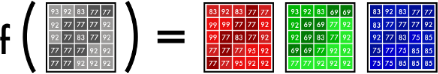

# ` `**Image Colorization basic implementation with CNN**

**Introduction:**

Image colorization is a compelling field in computer vision that focuses on converting grayscale or monochrome images into color images. This process is not only valuable for restoring historical photographs and enhancing visual media but also for improving the aesthetics and usability of images in various applications. Historically, image colorization has been performed manually, a labor-intensive process requiring considerable artistic skill. However, advancements in machine learning and deep learning have revolutionized this field, making automated colorization more efficient and accessible.

The latest neural network technique involves the use of Resnet for feature extraction and combines or fusing it with a layer that comes after pooling/downsampling of the input or encoded layer and then decoding it with convolution layers through upsampling to predict the colored image. Also, there are various types of GAN such as pix2pix GAN, Cycle gan which are much more advanced techniques for image colorization.

The auto-encoder network which I have explained in this model also servers the purpose of a generator in the GAN network. There understanding this notebook would help you further in understanding complex networks and methodologies involved in image colorization.

Today, colorization is usually done by hand in Photoshop. To appreciate all the hard work behind this process, take a peek at this gorgeous colorization memory lane video:

In short, a picture can take up to one month to colorize. It requires extensive research. A face alone needs up to 20 layers of pink, green and blue shades to get it just right.

This article is for beginners. Yet, if you’re new to deep learning terminology, you can read my previous two posts here and here, and watch Andrej Karpathy’s lecture for more background.

The first section breaks down the core logic. We’ll build a bare-bones 40-line neural network as an

―alpha‖ colorization bot. There’s not a lot of magic in this code snippet. This well help us become familiar with the syntax.

The next step is to create a neural network that can generalize — our ―beta‖ version. We’ll be able to color images the bot has not seen before.

For our ―final‖ version, we’ll combine our neural network with a classifier. We’ll use an Inception Resnet V2 that has been trained on 1.2 million images. To make the coloring pop, we’ll train our neural network on portraits from Unsplash.

Abstract 

Image colorization is the process of converting grayscale images into colored ones, often leveraging deep learning techniques. Traditional methods relied on manual coloring or heuristic-based algorithms, but modern approaches use convolutional neural networks (CNNs) to predict color information. These networks are trained on large datasets of paired grayscale and colored images, learning to map luminance values to their likely chromatic counterparts. By preserving structural information and applying color hues intelligently, these models generate plausible, vibrant images. Applications range from restoring historical photographs to enhancing medical imaging and entertainment media. Recent advances include GANs and self-supervised learning for improved color accuracy and naturalism.

In this section, I’ll outline how to render an image, the basics of digital colors, and the main logic for our neural network.

Black and white images can be represented in grids of pixels. Each pixel has a value that corresponds to its brightness. The values span from 0–255, from black to white.

Color images consist of three layers: a red layer, a green layer, and a blue layer. This might be counter- intuitive to you. Imagine splitting a green leaf on a white background into the three channels. Intuitively, you might think that the plant is only present in the green layer.

But, as you see below, the leaf is present in all three channels. The layers not only determine color, but also brightness.

To achieve the color white, for example, you need an equal distribution of all colors. By adding an equal amount of red and blue, it makes the green brighter. Thus, a color image encodes the color and the contrast using three layers:

Just like black and white images, each layer in a color image has a value from 0–255. The value 0 means that it has no color in this layer. If the value is 0 for all color channels, then the image pixel is black.

As you may know, a neural network creates a relationship between an input value and output value. To be more precise with our colorization task, the network needs to find the traits that link grayscale images with colored ones.

In sum, we are searching for the features that link a grid of grayscale values to the three color grids.

# **Scope of the Study:**

1. The title " **Image Colorization** " encompasses a wide range of research and practical applications focused on utilizing advanced computational techniques to enhance the detection and diagnosis of skin cancer. The scope of this study includes the following key areas:

# **Techniques and Algorithms:**

0. **Traditional Methods:** Initial approaches to image colorization relied on algorithmic techniques, such as using color transfer methods and segmentation to assign colors to different regions of an image.
0. **Machine Learning Approaches:** The advent of machine learning, particularly deep learning, has introduced more sophisticated techniques. Convolutional Neural Networks (CNNs), Generative Adversarial Networks (GANs), and autoencoders have become prevalent in learning colorization from large datasets of color images.
1. # **Data Preparation and Augmentation:**
   0. **Dataset Collection:** High-quality datasets of color images are crucial for training colorization models. These datasets often include paired grayscale and color images.
   0. **Data Augmentation:** Techniques like cropping, rotating, and color jittering are used to increase the diversity of training data and improve model generalization.
1. # **Model Training and Evaluation:**
   0. **Model Architecture:** Deep learning models for colorization typically involve complex architectures, including CNNs for feature extraction and GANs for generating realistic colors.
   0. **Performance Metrics:** The effectiveness of colorization models is evaluated using metrics such as Mean Squared Error (MSE), Structural Similarity Index (SSIM), and perceptual quality assessments to gauge how well the colors match real-world expectations.
1. # **Applications and Impact:**
   0. **Historical Image Restoration:** Colorization techniques are used to restore and bring historical black-and-white photographs to life, providing a more vivid and engaging historical record.
   0. **Media and Entertainment:** In the media industry, colorization enhances visual content for movies, TV shows, and advertisements, making them more appealing and relatable to contemporary audiences.
   0. **Medical Imaging:** Colorization can aid in visualizing medical images, such as enhancing contrast in X-rays or MRIs, thereby assisting in better diagnosis and analysis.
1. # **Challenges and Future Directions:**

0. **Color Accuracy and Realism:** Ensuring that the colors generated by models are realistic and accurate remains a challenge, as models often struggle with distinguishing subtle color nuances.
0. **Generalization Across Domains:** Models need to be robust enough to handle diverse types of images and contexts, which requires extensive training data and advanced techniques.
0. **Computational Resources:** Training state-of-the-art colorization models demands substantial computational power, which can be a barrier for some researchers and practitioners.

# **Methodology:**

The methodology for image colorization using deep learning involves several key steps, ranging from data collection and preprocessing to model training and evaluation. Below is a structured methodology based on recent research:

# **RGB space-based method**

RGB color space is the most well-known color space, which is widely used in various fields of image processing. This color space consists of three channels: red (R), green (G), and blue (B). Each color channel has 256 gray values (0–255), and each channel can be combined in a specific proportion to present different colors. However, there are some problems with the RGB color space. For example, the color changes with the value of each channel; the gray value of each channel of a certain color is difficult to express accurately.

RGB color space is the most widely used in the line art image colorization task , which is mainly because, compared with gray image, line art image only has simple line composition, neither gray value nor semantic information, so it is difficult to realize the colorization in the color-light separable color space. For example, [Zhang* et al. (2018) ](https://www.sciencedirect.com/science/article/pii/S0952197622001920#b162)proposed a semi-automated colorization model based on RGB color space, which solves artifacts such as watercolor blur color distortion and dark texture to some extent. Similarly, a GANs-based line art colorization method was proposed by [Seo and Seo](https://www.sciencedirect.com/science/article/pii/S0952197622001920#b119) [(2021). ](https://www.sciencedirect.com/science/article/pii/S0952197622001920#b119)This method achieves good colorization performance in RGB color space. In addition, RGB color space is also used in gray image colorization tasks, and has achieved a favorable colorization effect.

**Separable space-based method**

The [Human Visual System ](https://www.sciencedirect.com/topics/computer-science/human-visual-system)(HVS) is less sensitive to color than to brightness. In the RGB color space, three primary colors are equally important, but the brightness information is ignored. In color-light separable color space, the chroma information and the brightness information of the image can be separated, so that we can handle the chroma and brightness information, separately. This kind of color space is closer to human vision and more convenient for color editing. In general, the separable space- based method consists of three stages,and CIELAB color space here is taken as an example. Firstly, the brightness channel L (grayscale image) is input into the colorization model to obtain the two missing channels A and B. Then, the complete CIELAB color image is obtained by combining the

obtained [chrominance ](https://www.sciencedirect.com/topics/engineering/chrominance)AB with the input brightness channel L. Finally, the merged image is converted to RGB color space through color space conversion to obtain the final color image.

Compared with RGB space-based methods, the separable space-based methods only need to predict the other two missing channels except for the brightness channel, which makes the model training

more stable .We will introduce three commonly used color-light separable color spaces, including CIELAB, YUV, and HSV color space as follows.

**Lab Color Space (CIELAB)**

Lab (also written as L\*a\*b\*) is a color space defined by the International Commission on Illumination (CIE) in 1976.

It expresses colors using 3 values:

L\* (luma), represents perceived brightness.

a\* (red — green) and b\* (blue — yellow), represent human visual colors.

Lab aims to be perceptually uniform, meaning that given numeric changes correspond to similar perceived color changes, which is useful for detecting subtle color differences.

Lab is commonly used for color correction, image analysis, and computer vision.

3. # **Challenges in Image Colorization Loss of Color Information**
   A fundamental challenge in image colorization is the loss of color information during the conversion to grayscale. Color images capture the richness of the real world by encoding the full spectrum of light hitting each pixel. This spectrum is typically represented using three channels: red, green, and blue (RGB). Grayscale images, on the other hand, discard this detailed color data and only retain the luminance information, essentially representing how bright or dark each pixel is. This loss of information creates a significant obstacle for colorization algorithms. Imagine a historical black and white photograph of a bustling city street. The grayscale image tells us nothing about the colors of the cars, buildings, or clothing — crucial details for a realistic colorization. Colorization algorithms must grapple with this missing data, employing sophisticated techniques to infer and reconstruct the lost color information based on the remaining grayscale cues and any additional contextual information available.

**Ambiguity in Grayscale Images**

One of the major challenges in image colorization stems from the inherent ambiguity present in grayscale images. Unlike color images that capture the full spectrum of light, grayscale images only represent luminance, or brightness. This lack of color information creates a significant hurdle. Imagine a

shade of mid-gray in a grayscale photo. That same shade of gray could represent a vast array of colors in the real world, from the red of an apple to the blue of the sky or even the brown of a tree trunk. This ambiguity makes it difficult for colorization algorithms to definitively assign colors to grayscale pixels, requiring them to rely on additional information or make educated guesses to achieve a realistic outcome.
# **Lack of Semantic Understanding**

Unlike humans, who can readily interpret the content of an image and identify objects, materials, and their spatial relationships, current colorization algorithms often struggle with this crucial aspect.

Grayscale images lack the rich information that allows us to distinguish between a brown bear and a polar bear, for instance. This semantic ambiguity presents difficulties. Colorization algorithms may assign colors based solely on local image features, potentially leading to unrealistic color choices.

Imagine a grayscale photo of a cityscape. Without semantic understanding, the algorithm might color a specific shade of gray as brown, mistaking it for a building, when it actually represents a person’s dark clothing.
# **Computational Complexity**
This refers to the amount of computing power and resources required to process an image and generate realistic color predictions. Here’s a breakdown of the contributing factors:

**Image Size**: Larger images with more pixels demand significantly more processing power to analyze and colorize compared to smaller images.

**Algorithm Complexity**: Modern colorization techniques, particularly those employing deep learning models, involve complex calculations and numerous parameters. Executing these algorithms efficiently requires significant computational resources.

**Optimization Techniques**: Colorization algorithms often involve iterative optimization processes to refine color predictions. Each iteration requires computations, and the number of iterations can significantly impact overall processing time.

These factors combine to make image colorization a computationally demanding task. Researchers are constantly working on optimizing algorithms and utilizing techniques like hardware acceleration to reduce processing time and make colorization more efficient on standard computing platforms.
# **Perceptual Color Constancy**

Our brains are remarkably adept at compensating for variations in lighting conditions, allowing us to perceive object colors as relatively consistent despite changes in illumination. For instance, a red apple appears red under both sunshine and indoor lighting, even though the reflected light spectrum reaching our eyes differs in each scenario. This ability, known as perceptual color constancy, complicates image colorization. Colorization algorithms need to not only predict colors for grayscale pixels but also ensure those predicted colors appear consistent with the perceived lighting in the scene. Imagine a grayscale image of a landscape at dusk. The algorithm must not only assign colors to the sky and trees, but also account for the warm, yellowish light typical of dusk to achieve a realistic and believable colorization.

# **Color Inconsistency (Color Bleeding)**

A significant challenge arises from color bleeding, also referred to as color inconsistency. This occurs when the predicted colors for neighboring regions in the image fail to respect clear boundaries. Imagine a grayscale photo of a red rose next to a green leaf. During colorization, color bleeding might cause the red color of the rose to spill over and contaminate the edges of the leaf, resulting in a greenish tinge.

This happens because colorization algorithms often rely on local image features and may struggle to differentiate between distinct objects with similar grayscale values. The result is a colorization that appears unrealistic and lacks crisp definition between objects.

3. # **Traditional Approaches to Image Colorization Manual Colorization Techniques**
   This is the most basic and time-consuming approach to image colorization, where each pixel in the grayscale image is manually colored using a paintbrush or similar tool. This method is often used by artists to create highly detailed and personalized colorizations, but it is not practical for large-scale or automated colorization tasks.

# **Rule-based Methods**

These methods use predefined rules to automatically colorize grayscale images. For example, a rule- based method might use the fact that grass is often green and the sky is often blue to automatically colorize those parts of the image. Rule-based methods can be fast and efficient, but they may not always produce accurate or realistic results, especially for complex or ambiguous images.

# **Color Propagation Techniques**

These methods use the color information from known or reference regions of the image to propagate or spread the color to other parts of the image .For example, if a colorization algorithm knows that a certain region of the image is a tree, it can use the color information from other trees in the image to infer the correct color for that region. This can produce more coherent and realistic colorizations than histogram matching, but it requires a large and diverse dataset of reference images to work effectively.

# **Conclusion:**

The field of image colorization has seen significant advancements with the integration of machine learning techniques. Automated colorization not only simplifies and accelerates the process of adding color to grayscale images but also opens new possibilities in various domains, including media, history, and medicine. Continued research and development in this field are expected to improve the realism and applicability of colorization models, making them increasingly valuable tools in both creative and practical applications.

Flowchart:

References:

1. [https://www.freecodecamp.org/news/colorize-b-w-photos-with-a-100-line-neural-network-](https://www.freecodecamp.org/news/colorize-b-w-photos-with-a-100-line-neural-network-53d9b4449f8d) [53d9b4449f8d](https://www.freecodecamp.org/news/colorize-b-w-photos-with-a-100-line-neural-network-53d9b4449f8d)

1. `	`[https://www.learnopencv.com/convolutional-neural-network-based-image-colorization-](https://www.learnopencv.com/convolutional-neural-network-based-image-colorization-using-opencv/) [using-opencv/](https://www.learnopencv.com/convolutional-neural-network-based-image-colorization-using-opencv/)

1. [https://www.kaggle.com/code/basu369victor/image-colorization-basic-implementation-with-](https://www.kaggle.com/code/basu369victor/image-colorization-basic-implementation-with-cnn) [cnn](https://www.kaggle.com/code/basu369victor/image-colorization-basic-implementation-with-cnn)
1. <https://www.researchgate.net/publication/301817406_Image_Colorization_Using_a_Deep_Convolutional_Neural_Network>
1. <https://paperswithcode.com/task/image-colorization>
1. <https://www.mdpi.com/2073-8994/14/11/2295>
1. <https://ijisae.org/index.php/IJISAE/article/view/4511>

